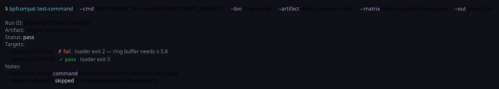
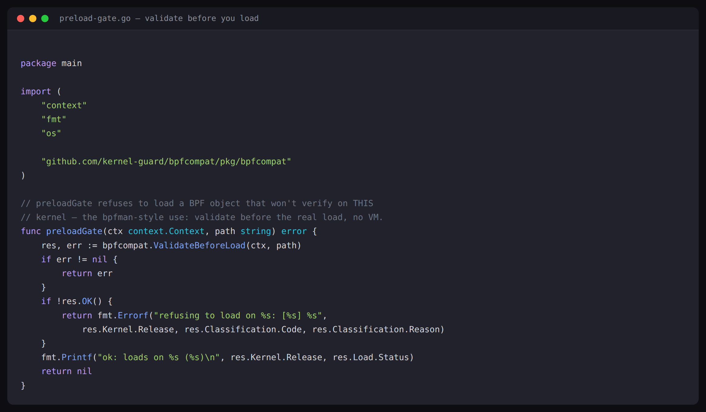
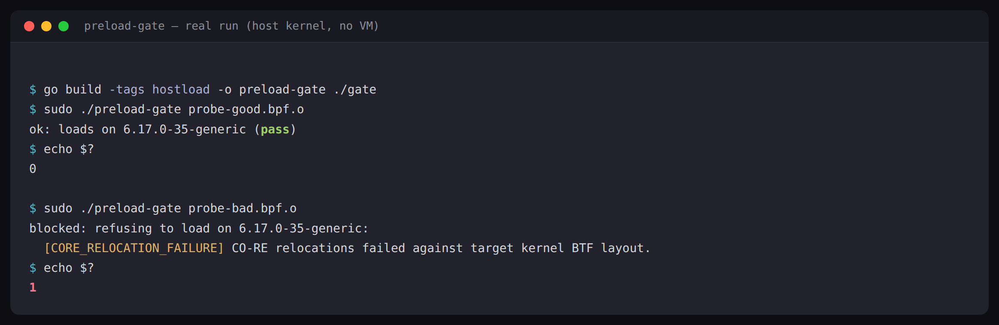
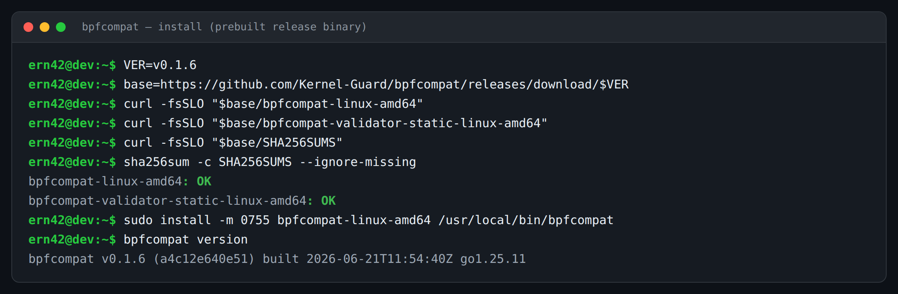
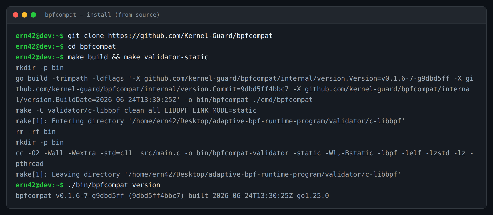
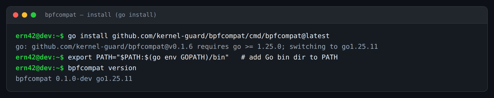
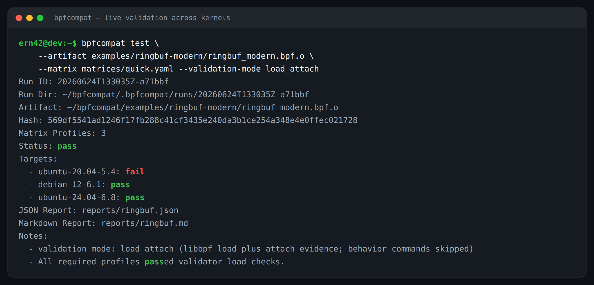

# bpfcompat

[](https://github.com/Kernel-Guard/bpfcompat/actions/workflows/ci.yml)
[](https://github.com/Kernel-Guard/bpfcompat/actions/workflows/codeql.yml)
[](https://scorecard.dev/viewer/?uri=github.com/Kernel-Guard/bpfcompat)
[](https://www.bestpractices.dev/projects/13230)
[](LICENSE)


`bpfcompat` is an open-source compatibility validator for compiled eBPF
artifacts. **Test your eBPF across real kernels — locally or in CI.** It boots
real distro kernels in disposable VMs, runs libbpf load/attach checks, and
produces JSON/Markdown reports that can fail CI when an artifact regresses — so
the answer is empirical, not inferred from CO-RE.

The core question is simple:

> Will this `.bpf.o` load and attach on the kernels I care about, and if not,
> what failed?

Point it at a local `.bpf.o` or a **published gadget by OCI reference**, on your
laptop or as a CI gate — `--quick` needs no matrix file:

```sh
bpfcompat test --artifact ghcr.io/inspektor-gadget/gadget/trace_open:latest --quick
```

**Live demo:** [bpfcompat.kernelguard.net](https://bpfcompat.kernelguard.net) — upload a
`.bpf.o` and see the compatibility matrix.

**Quickstart & trust model:** [docs/quickstart.md](docs/quickstart.md) — gate it in CI
in ~10 minutes; self-hosted-first, your artifact never leaves your runner.

## Why not just rely on CO-RE / BTFHub?

CO-RE makes a `.bpf.o` *portable in principle*; it does not guarantee it will
*load* on a given kernel. Real-world failures that CO-RE does not prevent:

- missing or partial kernel BTF,
- CO-RE relocation errors against a divergent kernel,
- unsupported map types (e.g. ringbuf before 5.8),
- unsupported program/attach types,
- capability and kernel-config differences.

`bpfcompat` answers the empirical question CO-RE leaves open: *does it actually
load and attach here?* — by running the artifact in a real kernel.

## How validation works: full VMs, not static analysis

bpfcompat does **not** parse your object and guess. For every target it:

1. boots the **real distro cloud image and its actual kernel** as a disposable
   QEMU/KVM virtual machine (default `--runner vm`; `virtme-ng`, `firecracker`,
   and `host` are also selectable);
2. copies a **C/libbpf validator and your `.bpf.o` into the guest** over a
   per-run SSH key;
3. runs the **real `bpf()` load — and attach, in `load_attach` mode — inside
   that kernel**, then copies a structured result back and throws the VM away.

So a verdict is what the kernel itself accepted or rejected (verifier log, BTF,
CO-RE relocation, map/program/attach support), not a heuristic. Each run leaves
per-target evidence — `serial.log` (the guest kernel boot), `qemu.log`, and
`validator-result.json`.

### Validate via your own loader (command mode)

The bundled validator answers "does this `.bpf.o` load/attach?" Sometimes you
want to answer "does **my project's actual loader** come up on this kernel?" —
which also exercises your userspace path and needs no manifest kept in sync with
that loader. Command mode does exactly that: it runs your loader command
(optionally a binary you ship in) **inside each matrix kernel VM**, and the
per-kernel verdict is its **exit code**. The bundled validator is *not* used, so
this tests the real userspace loader path.

```bash
# Dedicated verb: ship your loader, run it on every kernel, exit code = verdict.
bpfcompat test-command --cmd '$BPFCOMPAT_BIN --self-test' \
  --bin ./build/myloader --matrix matrices/mvp.yaml --out report.json

# Equivalent flag form on `test`, e.g. driving a loader against a shipped .bpf.o:
bpfcompat test --command '$BPFCOMPAT_BIN --obj $BPFCOMPAT_ARTIFACT' \
  --command-binary ./build/loader --artifact ./build/probe.bpf.o \
  --matrix matrices/mvp.yaml --out report.json
```

A real run, shipping a libbpf loader and pointing it at the
[known-tricky kernel library](docs/kernel-quirk-library.md) — the loader's exit
code catches the ring-buffer incompatibility on 5.4 and passes 5.15, with no
validator load in between:



The command runs as root in the disposable guest with `$BPFCOMPAT_BIN` (your
shipped binary), `$BPFCOMPAT_ARTIFACT` (a staged `.bpf.o`, if given), and
`$BPFCOMPAT_REMOTE_ROOT` exported. See
[docs/command-validation.md](docs/command-validation.md).

If your project loads with **ebpf-go** (cilium/ebpf) rather than libbpf, ship an
ebpf-go loader the same way — ebpf-go is a separate loader implementation, so a
libbpf pass does not guarantee an ebpf-go pass. A complete static-loader recipe
lives in [docs/ebpf-go-validation.md](docs/ebpf-go-validation.md).

Point either flow at the **library of known-tricky vendor kernels** — the ones
where "version ≠ feature support" bites (ring-buffer boundary, enterprise
backports, no-BTF, vendor rebases, variant bands):

```bash
bpfcompat test --command '$BPFCOMPAT_BIN --self-test' --command-binary ./build/loader \
  --matrix matrices/quirk-library.yaml --out report.json
```

See [docs/kernel-quirk-library.md](docs/kernel-quirk-library.md). The library
is re-validated weekly and the resulting matrix is published at
[kernel-guard.github.io/bpfcompat](https://kernel-guard.github.io/bpfcompat/).

### Distributions covered

A curated, multi-distro, multi-architecture matrix of the kernels enterprises
and cloud fleets actually run (full list in
[docs/profile-catalog.md](docs/profile-catalog.md)):

| Family | Versions / kernels |
|---|---|
| Ubuntu | 16.04 → 25.10 (5.4, 5.8, 5.15, 6.5, 6.8, 6.11, 6.14, 6.17) |
| Debian | 11 · 12 · 13 |
| RHEL¹ / AlmaLinux / Rocky / CentOS Stream | 8 (4.18) · 9 (5.14) · 10 (6.12) |
| Oracle Linux (UEK) | UEK 7 · UEK 8 |
| Amazon Linux | 2 (4.14, 5.10) · 2023 (6.1) |
| SUSE / openSUSE Leap | 15.6 (6.4) |
| Upstream mainline | kernel.org 5.x–6.x sweeps |

Architectures: **x86_64 and ARM64**. ¹RHEL itself is a BYO subscription image;
AlmaLinux/Rocky/CentOS Stream are the public, ABI-compatible rebuilds used as the
reproducible RHEL stand-in.

### Kernel version ≠ feature support (backports)

Enterprise distros **heavily backport** eBPF features onto old kernel bases, so
the version number alone predicts nothing. Because bpfcompat boots the real
vendor kernel, this is tested directly instead of inferred:

- A ring-buffer program **fails on Ubuntu's vanilla 5.4** (ring buffer lands
  upstream in 5.8) yet **passes on AlmaLinux 8's backported 4.18**.
- **Amazon Linux 2's 4.14 — with no embedded BTF — still loads and attaches.**

This is proven across a 14/14 enterprise tier:
[docs/case-study-enterprise-kernels.md](docs/case-study-enterprise-kernels.md).

### CoreOS / OpenShift (Ignition boot)

CoreOS-family nodes boot via **Ignition**, not cloud-init, so they need a
different bootstrap. bpfcompat implements it (Ignition config over QEMU
`-fw_cfg`), and the two cases differ only by image availability:

- **Fedora CoreOS — supported, image is public.** Fetch with
  `make vm-image-fcos` and run; proven booting FCOS stable (kernel `7.0.11`) with
  load + attach inside the guest.
- **RHCOS / OpenShift — opt-in, operator-supplied image.** RHCOS ships with an
  OpenShift release rather than an evergreen public cloud image, so it is **off
  by default** and never claimed runnable without a real image. Stage your image
  and opt in:

  ```sh
  make rhcos-image RHCOS_IMAGE=/path/to/rhcos-qemu.x86_64.qcow2   # or RHCOS_IMAGE_URL=...
  BPFCOMPAT_ENABLE_RHCOS=1 bpfcompat test -artifact build/probe.bpf.o \
    -matrix matrices/rhcos.yaml -runner vm -out report.json
  ```

  Recorded evidence — real boots, not claims, and not just 4.16: **OpenShift
  4.14, 4.16, and 4.18 on x86_64 (6 artifacts each), plus OpenShift 4.16 on
  aarch64** — [docs/evidence-rhcos.md](docs/evidence-rhcos.md), with a
  machine-readable [docs/report-rhcos-summary.json](docs/report-rhcos-summary.json).
  Highlights: ring-buffer and perf-buffer load+attach pass on every release; a
  **BPF-LSM** program is rejected on 4.14 (RHEL 9.2) but loads+attaches all hooks
  on 4.16/4.18 (RHEL 9.4) — a real backport boundary; a CO-RE failure is
  correctly rejected everywhere; and the aarch64 boot
  (`5.14.0-427.50.1.el9_4.aarch64`) load+attaches under emulation. Without an
  image, the **RHEL / AlmaLinux 9 (5.14)** profiles are the interim kernel
  approximation. Full guide: [docs/rhcos-openshift.md](docs/rhcos-openshift.md).

## Library mode: embed the pre-load gate

Beyond the CLI and the GitHub Action, bpfcompat is an embeddable Go library
([`pkg/bpfcompat`](https://github.com/Kernel-Guard/bpfcompat/tree/main/pkg/bpfcompat)).
`ValidateBeforeLoad` does a real `bpf()` load against the node's **own running
kernel** — no VM, no network — so a loader (e.g. bpfman) can refuse an object
that won't verify *before* it loads it. Host loading is gated behind the
`hostload` build tag and needs `CAP_BPF`/`CAP_SYS_ADMIN`.

A complete, real example is [`examples/preload-gate`](examples/preload-gate):



```sh
go get github.com/kernel-guard/bpfcompat@v0.2.0
go build -tags hostload -o preload-gate ./examples/preload-gate
sudo ./preload-gate probe.bpf.o
```

A compatible object passes; an incompatible one is blocked with the kernel's own
verdict and a stable classification code — exit 0 vs 1:



See [`pkg/bpfcompat/README.md`](pkg/bpfcompat/README.md) for the full API.
(Pre-1.0 / experimental.)

## Try it in CI without your own KVM box

GitHub-hosted Linux runners now expose `/dev/kvm`, so the full QEMU VM
compatibility gate runs on a stock `ubuntu-latest` runner — no self-hosted KVM
machine required. This is proven end-to-end:
[`.github/workflows/bpfcompat-example-hosted.yml`](.github/workflows/bpfcompat-example-hosted.yml)
boots a disposable VM and runs the `dev-functional` suite (load + behavioral
execve) in **under two minutes**.

One gotcha: some hosted images expose `/dev/kvm` but the runner user isn't in
the `kvm` group, so QEMU can't open it. The example workflow runs
`sudo chmod 0666 /dev/kvm` to handle that. If a runner genuinely lacks KVM,
validation degrades to TCG software emulation (correct, just slower) instead of
failing.

## Proof: a real Falco probe catches a real regression

`bpfcompat` validates Falco's `modern_bpf` probe (`bpf_probe.o`, ~64 programs)
**the way Falco's `libpman` loads it** — runtime-sized maps, helper-gated program
variants, and trial-probed BPF iterators, declared in a manifest so a plain
libbpf load doesn't undercount support. (This *mirrors* libpman's loader
contract; it is not Falco's loader binary itself — to run that exact binary, use
[command mode](docs/command-validation.md).) Across a 5-kernel matrix:

| Profile | Host kernel | Status | Why |
|---|---|---|---|
| `ubuntu-20.04-5.4` | `5.4.0-216` | ❌ fail | `UNSUPPORTED_MAP_TYPE` — ringbuf needs ≥ 5.8 |
| `ubuntu-22.04-5.15` | `5.15.0-173` | ✅ pass | loads; selects `*_old_x` syscall variants |
| `debian-12-6.1` | `6.1.0-47` | ✅ pass | loads; full variant set |
| `ubuntu-23.10-6.5` | `6.5.0-44` | ✅ pass | loads; full variant set |
| `ubuntu-24.04-6.8` | `6.8.0-106` | ✅ pass | loads; full variant set |

The red `5.4` row is the point: a kernel below Falco's real floor is flagged
*before* shipping, with the exact mechanism (`ringbuf_maps` create returns
`-EINVAL`) and remediation — not a generic "it broke." Reproduce this matrix
locally; see [`docs/falco-parity.md`](docs/falco-parity.md).

## Validate a published gadget in one command

eBPF gadgets ship as OCI images. Point `bpfcompat` at one by reference — it
extracts the eBPF object, auto-sizes runtime-sized maps, and validates it across
kernels with no manifest and no matrix file:

```sh
bpfcompat test --artifact ghcr.io/inspektor-gadget/gadget/trace_open:latest --quick
```

Pulled straight from the registry, Inspektor Gadget's `trace_open`/`trace_exec`
load and attach on 6.1/6.8 and are correctly flagged on 5.4 (the `events` ring
buffer needs ≥ 5.8) — and `trace_open` passes on AlmaLinux 8's backported 4.18,
the textbook "kernel version ≠ feature support" case. Full write-up, including
the `trace_dns` loader-contract finding:
[`docs/case-study-inspektor-gadget.md`](docs/case-study-inspektor-gadget.md).

## Current Status

The project is a serious MVP for compatibility evidence and CI gating. It is
not a production runtime loader and it is not a production multi-tenant SaaS.

Implemented:

- VM-backed `.bpf.o` validation through QEMU/KVM cloud images.
- **Command/binary validation** (`bpfcompat test-command` / `test --command`) —
  run *your own* loader binary/command inside each kernel VM and take its **exit
  code** as the per-kernel verdict. The bundled validator is **not** used in this
  mode; this tests the real userspace loader path. See
  [docs/command-validation.md](docs/command-validation.md).
- **Library of known-tricky vendor kernels** (`matrices/quirk-library.yaml`) —
  the kernels where "version ≠ feature support" bites; run a `.bpf.o` or your
  own loader against the whole set. See
  [docs/kernel-quirk-library.md](docs/kernel-quirk-library.md).
- C/libbpf validator that records load, attach, BTF, CO-RE, map, program, and
  capability evidence (the default `.bpf.o` flow).
- Failure classification for common compatibility cases such as missing BTF,
  CO-RE relocation failures, unsupported map types, unsupported attach types,
  and unsupported program types.
- Multi-artifact suite support for collections of BPF objects/programs.
- JSON, Markdown, GitHub Action summary, and static compatibility-site output.
- Experimental `virtme-ng` upstream-kernel lane.
- Experimental Firecracker generated-initramfs backend.
- Experimental runtime probe/select/fetch/agent flow for verified artifact
  decisioning.

Keep the runtime track framed as decisioning/proof unless you are running it in
a controlled environment. Host loading stays disabled/gated by default.

## Install

There are three ways to get the CLI. Most users want the prebuilt release
binary or the source build, because running `bpfcompat test` also needs the
guest-side validator binary and the kernel matrices that ship in this repo.

**1. Prebuilt release binary (recommended, Linux x86_64).** Ships the CLI *and*
the static validator, checksum-verified:

```bash
VER=v0.2.0
base="https://github.com/Kernel-Guard/bpfcompat/releases/download/$VER"
curl -fsSLO "$base/bpfcompat-linux-amd64"
curl -fsSLO "$base/bpfcompat-validator-static-linux-amd64"
curl -fsSLO "$base/SHA256SUMS"
sha256sum -c SHA256SUMS --ignore-missing
sudo install -m 0755 bpfcompat-linux-amd64 /usr/local/bin/bpfcompat
bpfcompat version
```



**2. From source.** Builds both the CLI and the validator and gives a binary
stamped with the real version:

```bash
git clone https://github.com/Kernel-Guard/bpfcompat
cd bpfcompat
make build && make validator-static
./bin/bpfcompat version
```



**3. `go install` (CLI only).** Note the module path is **lowercase** and the
command **must** point at the `cmd/bpfcompat` subpackage — the module root has
no `main` package, so `go install github.com/Kernel-Guard/bpfcompat@latest`
fails with *"found, but does not contain package …"*:

```bash
go install github.com/kernel-guard/bpfcompat/cmd/bpfcompat@latest
```

This installs the orchestrator CLI only (it reports version `0.1.0-dev` because
`go install` does not inject build-time ldflags). To run `bpfcompat test` you
still need the validator binary (from a release or `make validator-static`) and
a kernel matrix — use option 1 or 2 for that.



### What a run looks like

Once installed, `bpfcompat test` boots each kernel in a disposable VM and reports
a per-kernel pass/fail matrix — here the `ringbuf_modern` example across three
kernels, correctly failing on 5.4 (ring buffer support lands in 5.8) and passing
on 6.1 and 6.8:



## Prerequisites

For the main QEMU path:

- Linux host (a GitHub-hosted `ubuntu-latest` runner works; `/dev/kvm`
  enables hardware acceleration, and bpfcompat falls back to TCG software
  emulation when it is absent)
- Go 1.25+
- `make`
- `clang`
- `qemu-system-x86_64`
- `qemu-img`
- `ssh`
- `scp`
- `jq`
- `pkg-config`
- development packages for `libbpf`, `libelf`, and `zlib`

Optional lanes:

- ARM64 VM execution requires an ARM64/aarch64 KVM host, `qemu-system-aarch64`,
  an ARM64 cloud image, and an ARM64 validator binary.
- Upstream-kernel execution requires `virtme-ng` (`vng`) and `curl`.
- Firecracker execution requires a Firecracker binary, `/dev/kvm`, `busybox`,
  `cpio`, `gzip`, and an uncompressed guest kernel.

## Build

```bash
make doctor
make deps
make build
make validator
make examples
```

Restricted-network option:

```bash
make vendor
make test-vendor
```

Validator modes:

- `make validator` uses dynamic libbpf linking for local development.
- `make validator-static` builds the guest-side validator used by VM profiles.

## Quickstart: a collection across kernels

Compatibility questions are rarely about one file. A release ships a
collection of BPF objects, and individual programs load differently across
kernels — so suites are the primary workflow: artifacts + manifests + a
kernel matrix in, one collection-level pass/fail matrix out.

Fast first run (one VM profile):

```bash
make examples
make vm-ubuntu-22
make acceptance-suite-dev-one
```

Realistic collection across the 8-profile MVP matrix:

```bash
make examples oss-examples
make vm-images
./bin/bpfcompat suite \
  --suite suites/example-collection.yaml \
  --out reports/example-collection.json \
  --markdown reports/example-collection.md
```

Each case stages its artifact, boots a disposable VM overlay per kernel
profile, runs the C/libbpf validator inside the guest, and rolls the results
into a per-artifact × per-kernel matrix with structured failure reasons.
Exit code `2` means a required profile regressed, so the same command is the
CI gate.

### Single-artifact mode

```bash
./bin/bpfcompat test \
  --artifact examples/simple-pass/simple_pass.bpf.o \
  --manifest examples/simple-pass/manifest-dev-one.yaml \
  --matrix matrices/dev-one.yaml \
  --out reports/dev-one.json \
  --markdown reports/dev-one.md \
  --timeout 8m
```

`make acceptance-dev-one` wraps the same flow.

### Runtime-sized maps

Some artifacts compile maps with `max_entries=0` and size them from
userspace at load time (per-CPU arrays, ring buffers — Falco's `modern_bpf`
probe is the canonical example). Declare those maps in the manifest so the
validator mirrors what the real loader does before load:

```yaml
maps:
  - name: auxiliary_maps
    max_entries: cpus
  - name: ringbuf_maps
    max_entries: cpus
    inner_ringbuf_bytes: 8388608
```

See [`docs/validator.md`](docs/validator.md) for details.

### Dense kernel sweeps and freshness

One cloud image samples a kernel series at a single release. The sweep lane
installs exact kernel releases (from the distro archive pool, indexed by
[falcosecurity/kernel-crawler](https://github.com/falcosecurity/kernel-crawler))
inside the guest and reboots into them before validating:

```bash
./bin/bpfcompat kernel-sweep --profile ubuntu-22.04-5.15 --count 4
./bin/bpfcompat test --artifact app.bpf.o \
  --matrix matrices/kernel-sweep-ubuntu-22.04-5.15.yaml --timeout 20m ...
```

`bpfcompat kernel-freshness` compares each profile's last-validated kernel
against what its distro currently ships and flags stale evidence (run
weekly in CI). See [`docs/image-pipeline.md`](docs/image-pipeline.md).

## Main Acceptance Flows

Fast local checks:

```bash
make acceptance-dev-one
make acceptance-functional-dev-one
make acceptance-suite-dev-one
```

Full MVP matrix:

```bash
make vm-images
make acceptance
```

Expanded runnable matrix:

```bash
make vm-images-expanded-2026
make matrix-runnable
make acceptance-expanded-runnable
```

Real OSS artifact examples:

```bash
make oss-examples
make oss-evidence
```

`make oss-evidence` writes generated outputs under `evidence/oss-validation/`.

## Backend Lanes

QEMU/KVM distro profiles:

```bash
make acceptance-dev-one
```

Upstream-mainline smoke through `virtme-ng`:

```bash
make doctor-virtme
make upstream-kernel-runnable
make acceptance-upstream-kernel
```

Firecracker generated-initramfs proof:

```bash
make firecracker-preflight
make acceptance-firecracker-dev-one
```

ARM64 smoke:

```bash
make doctor-arm64-kvm
make acceptance-arm64-smoke
```

The ARM64 workflow is wired, but real ARM64 VM compatibility proof requires a
native ARM64 KVM runner.

## GitHub Action

This repository includes a composite action that runs `bpfcompat` and appends
the Markdown report to the GitHub Actions job summary. VM-backed validation
runs on a stock GitHub-hosted `ubuntu-latest` runner (which now exposes
`/dev/kvm`); a self-hosted KVM runner is only needed for wide matrices, ARM64,
or the Firecracker lane. See
[`.github/workflows/bpfcompat-example-hosted.yml`](.github/workflows/bpfcompat-example-hosted.yml).

Suite mode (recommended — gates the whole collection):

```yaml
- uses: Kernel-Guard/bpfcompat@v0.2.0
  with:
    suite: suites/project.yaml
    suite-out: reports/suite.json
    suite-markdown: reports/suite.md
```

Suite cases can opt into `validation_mode: load_only`, `load_attach`, or
`behavior`. Behavior mode runs manifest or suite smoke commands while BPF links
are alive and adds the result to the suite-level collection matrix.

Single artifact:

```yaml
- uses: Kernel-Guard/bpfcompat@v0.2.0
  with:
    artifact: path/to/program.bpf.o
    manifest: path/to/manifest.yaml
    matrix: path/to/matrix.yaml
    out: reports/bpfcompat.json
    markdown: reports/bpfcompat.md
    validation-mode: load_attach
    timeout: 8m
```

Command mode — run your project's own loader on every matrix kernel (the
per-kernel verdict is the loader's exit code), against the built-in
[library of known-tricky vendor kernels](docs/kernel-quirk-library.md):

```yaml
- uses: Kernel-Guard/bpfcompat@v0.2.0
  with:
    command: $BPFCOMPAT_BIN --self-test
    command-binary: build/myloader   # static or fully self-contained binary
    matrix: quirk-library            # bare name -> matrices/ shipped with the action
    out: reports/bpfcompat.json
```

Marketplace quick start:

1. Use a stock `ubuntu-latest` runner (it exposes `/dev/kvm`); a self-hosted
   KVM runner is only needed for wide matrices or ARM64.
2. Commit compiled `.bpf.o` artifacts (or point `command` at your loader),
   plus a matrix YAML — or use a built-in matrix name like `quirk-library`.
3. Use the action in CI to produce JSON, Markdown, and job-summary evidence.
4. Treat exit code `2` as a compatibility gate failure.

## Web UI / API

The embedded UI is useful for demos and local inspection:

```bash
make serve
```

Open:

- `http://127.0.0.1:8080/`
- `http://127.0.0.1:8080/results`

The API has `/api/v1/...` routes with legacy `/api/...` compatibility. For
route details, see:

- [`docs/openapi.yaml`](docs/openapi.yaml)
- [`docs/api-web-ui.md`](docs/api-web-ui.md)
- [`docs/env-reference.md`](docs/env-reference.md)

Public demo mode can allow anonymous validation/read/runtime-select/fetch
without enabling host execution. Runtime execute remains separately gated by
`BPFCOMPAT_API_ENABLE_RUNTIME_EXECUTE` and an approval token.

## Runtime Decisioning

> **Status:** experimental, and not the project's current focus. Active
> development centers on the CI compatibility workflow: suites, kernel
> matrices, and reports. This track is kept as a controlled proof and may
> change or be removed.

The runtime path is experimental and should be treated as a controlled proof:

```bash
make runtime-selector-proof
make runtime-delivery-proof
```

The safer product boundary is:

1. validate artifact variants in CI/VMs;
2. store signed compatibility metadata;
3. probe a target host;
4. select and fetch the best verified artifact;
5. leave host loading to an explicitly approved local agent path.

Relevant docs:

- [`docs/runtime-selector-simulation.md`](docs/runtime-selector-simulation.md)
- [`docs/production-runtime-agent-alpha.md`](docs/production-runtime-agent-alpha.md)
- [`docs/runtime-execute-policy.md`](docs/runtime-execute-policy.md)
- [`docs/security-model.md`](docs/security-model.md)
- [`docs/threat-model.md`](docs/threat-model.md)

## Documentation Map

User guide — start here:

- [`docs/architecture.md`](docs/architecture.md)
- [`docs/project-compatibility-suite.md`](docs/project-compatibility-suite.md) — suites and collection matrices
- [`docs/validator.md`](docs/validator.md) — what the in-guest validator checks
- [`docs/command-validation.md`](docs/command-validation.md) — validate via your own loader binary/command (exit-code verdict)
- [`docs/ebpf-go-validation.md`](docs/ebpf-go-validation.md) — validate through ebpf-go (cilium/ebpf): a libbpf pass ≠ an ebpf-go pass
- [`docs/kernel-quirk-library.md`](docs/kernel-quirk-library.md) — curated library of known-tricky vendor kernels (version ≠ feature support)
- [`docs/profile-catalog.md`](docs/profile-catalog.md) — kernel/distro profiles and image maintenance
- [`docs/image-pipeline.md`](docs/image-pipeline.md) — where images come from, integrity, adding profiles
- [`docs/upstream-kernel-virtme-ng.md`](docs/upstream-kernel-virtme-ng.md)
- [`docs/firecracker-backend.md`](docs/firecracker-backend.md)
- [`docs/rhcos-openshift.md`](docs/rhcos-openshift.md) — RHCOS/OpenShift (Ignition boot, operator-supplied image)
- [`docs/api-web-ui.md`](docs/api-web-ui.md)

Reference matrices (real, reproducible artifacts):

- [`docs/case-study-falco-modern-bpf.md`](docs/case-study-falco-modern-bpf.md) — Falco `modern_bpf` across 5 kernels
- [`docs/case-study-enterprise-kernels.md`](docs/case-study-enterprise-kernels.md) — RHEL/Oracle/Amazon/SUSE backported tier
- [`docs/case-study-inspektor-gadget.md`](docs/case-study-inspektor-gadget.md) — published gadgets from OCI, zero config
- [`docs/evidence-rhcos.md`](docs/evidence-rhcos.md) — RHEL CoreOS / OpenShift 4.14·4.16·4.18 × 6 artifacts (x86_64) + a real aarch64 boot

Internal evidence and program docs (acceptance records, runbooks, and
planning notes — useful for contributors, not needed to use the tool):

- [`docs/acceptance-tests.md`](docs/acceptance-tests.md)
- [`docs/falco-parity.md`](docs/falco-parity.md)
- [`docs/supply-chain.md`](docs/supply-chain.md) — supply-chain controls and maintainer repo settings
- [`docs/backend-execution-proof.md`](docs/backend-execution-proof.md)
- [`docs/external-ci-proof.md`](docs/external-ci-proof.md)
- remaining `docs/*.md` proof, runbook, and checklist documents

## Development

```bash
make test
make openapi-check
make env-docs-check
go vet ./...
golangci-lint run --timeout=5m
govulncheck ./...
```

See [`CONTRIBUTING.md`](CONTRIBUTING.md) for route, env, test, and changelog
expectations.

## Security

Report security issues through [`SECURITY.md`](SECURITY.md), not public issues.

Operator guidance:

- keep runtime execute disabled on public demos;
- require write auth or explicit anonymous-demo flags for POST paths;
- do not enable internal-host or `file://` fetches outside controlled tests;
- run host-loading flows only through a local policy-gated agent path.

### Supply-chain posture

- **Static analysis:** GitHub CodeQL (`codeql.yml`) plus `govulncheck` and
  `golangci-lint` in CI on every PR.
- **Dependency updates:** Dependabot (`dependabot.yml`) for Go modules and
  pinned GitHub Actions, grouped weekly.
- **Risk scoring:** OpenSSF Scorecard (`scorecard.yml`), published to the
  public Scorecard API (badge above).
- **Signed releases + SLSA provenance:** tag builds produce a CycloneDX SBOM,
  cosign keyless (Sigstore OIDC) signatures over the binaries / `SHA256SUMS` /
  SBOM, and **SLSA Build L3 build-provenance attestations** bound to the
  producing commit and workflow (`release-artifacts.yml`). Quick check:

  ```bash
  gh attestation verify ./bpfcompat-linux-amd64 --repo Kernel-Guard/bpfcompat
  ```

  Full verification steps (provenance, cosign, SBOM) are in
  [`docs/verifying-releases.md`](docs/verifying-releases.md).

Maintainer-side repo settings (branch protection, secret-scanning push
protection, OpenSSF Best Practices registration) are tracked in
[`docs/supply-chain.md`](docs/supply-chain.md).

## License

Apache-2.0. See [`LICENSE`](LICENSE).
